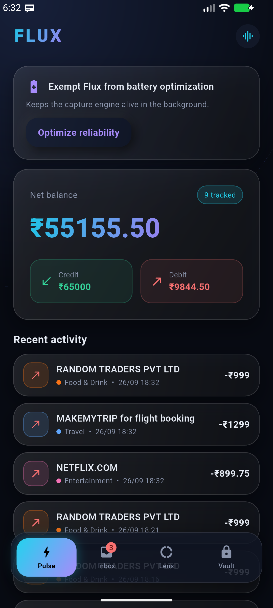
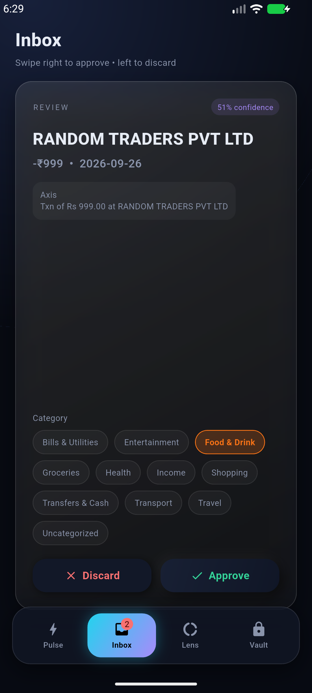
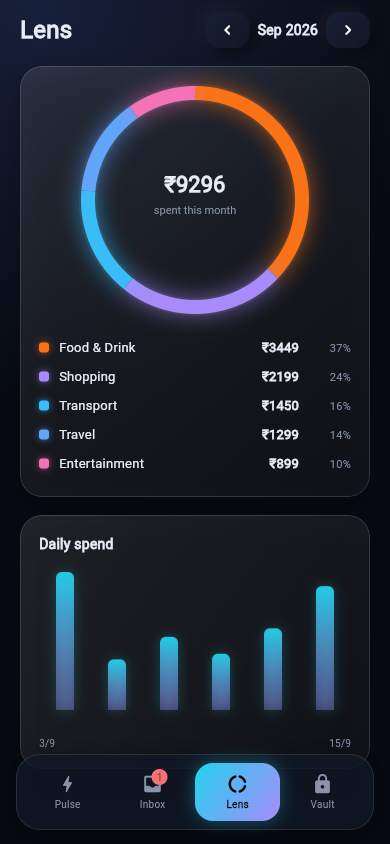
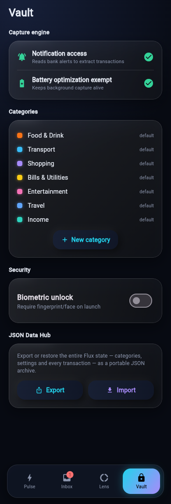

# Flux

[](https://github.com/Pranav-P-S/FLUX-finance-tracker/actions/workflows/ci.yml)
[](LICENSE)

Flux turns the bank and UPI notifications you already receive into a structured,
categorized transaction history — entirely on your device. No account linking,
no SMS permissions, no cloud.

| Pulse | Inbox | Lens | Vault |
|---|---|---|---|
|  |  |  |  |

## How it works

```
Notification posted (bank / UPI app)
        |
        v
NotificationListenerService     reads the alert, no SMS permission
        |
        v
TransactionEngine               1. filter noise (OTP, promos)
                                2. parse amount, direction, payee,
                                   account hint and date
                                3. deduplicate - SHA-256 of
                                   epoch-minute + amount + payee
                                4. categorize on-device
        |
        v
Room database  --changes-->  MethodChannel  -->  Flutter UI (Riverpod)
```

**Categorization is two-level.** A merchant dictionary answers first with high
confidence. Anything unmatched goes to a multinomial Naive Bayes model that
trains on device from a bundled corpus and grows with every correction you make
in the Inbox. When the model's confidence is below 80%, the transaction is held
for your review instead of being applied.

**Privacy model.** All parsing, storage and inference are local. Backups are
disabled (`allowBackup="false"`) because the database is as sensitive as the
notifications it came from. Export is opt-in and file-based via the JSON Data
Hub in Vault.

## Getting started

### Prerequisites

- Flutter (stable channel)
- Android SDK with platform 35 and build-tools 34+
- A device or emulator on API 26+

### Build and run

```bash
git clone https://github.com/Pranav-P-S/FLUX-finance-tracker.git
cd FLUX-finance-tracker
flutter pub get
flutter run
```

On first launch, grant **Notification access** from the Pulse onboarding card or
Vault -> Capture engine. Alerts from your bank are parsed the moment they
arrive; the notification is withdrawn once converted.

### Demo mode

The same interface runs in a browser against a fixed in-memory dataset - useful
for trying the UI without granting notification access:

```bash
flutter run -d chrome
```

## Development

```bash
flutter analyze                                    # static analysis
dart format --output=none --set-exit-if-changed .  # formatting gate
flutter test                                       # widget tests
```

Kotlin engine tests (parser, deduplication, classifier) run on the JVM through
Gradle:

```bash
cd android
./gradlew :app:testDebugUnitTest
```

CI runs analysis, Dart tests and JVM tests on every push and pull request.

## Project layout

```
lib/
  app.dart                 shell, navigation, native-change fan-out
  main.dart                biometric gate
  core/
    bridge/                platform-channel client + demo implementation
    theme/                 design tokens, glass and neumorphic primitives
  features/
    pulse/  inbox/  lens/  vault/
  providers/               Riverpod state
  widgets/                 charts, shared tiles

android/app/src/main/kotlin/com/flux/app/
  data/                    Room entities and DAOs
  parse/                   notification text extraction
  ml/                      classifier, dictionary, seed corpus
  engine/                  capture pipeline, deduplication, listener service
  bridge/                  MethodChannel surface, dependency container

docs/architecture.md       design notes and data contracts
```

## Roadmap

- Per-institution parsing rules on top of the generic extractor
- Payee normalization (collapse "SWIGGY", "Swiggy Ltd", "swiggy@ybl" variants)
- Budgets and monthly limits on top of category totals
- Scheduled CSV/JSON exports

## License

[MIT](LICENSE)
